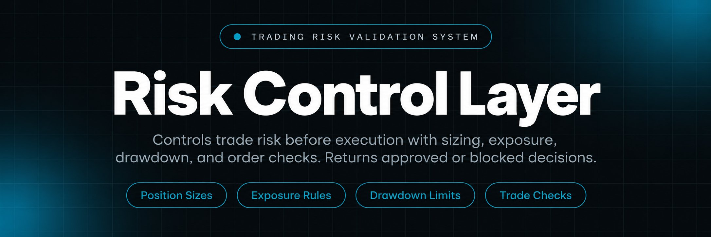
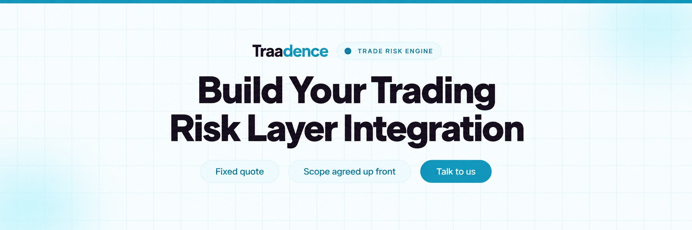
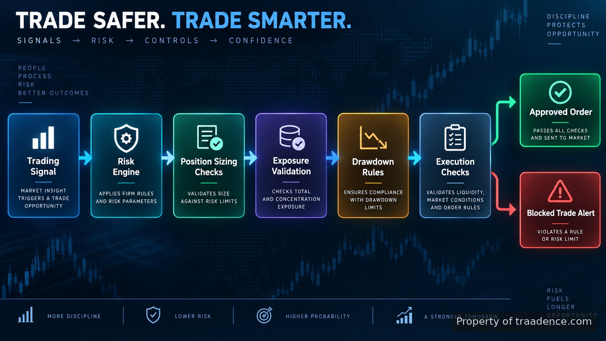

<p align="center">
  <a href="https://www.traadence.com" target="_blank" rel="nofollow">
    
  </a>
</p>

## Traadence's trading risk management tool

Traadence's trading risk management tool is a control layer built for traders and trading teams that need rules checked before orders are placed. The system sits between a strategy and execution layer, validating position size, exposure, drawdown limits, and execution conditions before allowing a trade to continue. It doesn't try to predict the market or improve a strategy's edge. Its entire job is to catch the orders that shouldn't go through, before they reach a broker.

> A risk layer that checks every order against defined trading rules.

The build focuses on prevention rather than replacing a strategy. A strategy can generate a signal, but the risk layer decides whether the order matches the configured limits. This keeps manual traders, automated bots, and execution services working through the same set of controls. That last point matters more than it might first appear: in most trading setups, manual orders and automated orders are checked by different logic, if they're checked at all. Routing everything through one validation layer means a discretionary trade and a bot-generated trade are held to exactly the same rules, with no exceptions carved out for either side.

This separation between signal generation and risk validation also makes the system easier to reason about over time. A strategy can be modified, replaced, or run alongside several other strategies without touching the risk configuration at all, because the risk layer doesn't care where an order request came from; it only cares whether the request fits inside the limits it's been given.

<a href="https://www.traadence.com" target="_blank" rel="nofollow">
  
</a>

<p align="center">
  <a href="https://t.me/Bitbash333" target="_blank" rel="nofollow">
    
  </a>&nbsp;
  <a href="https://wa.me/923249868488?text=Hi%2C%20I%27m%20interested%20in%20Traadence." target="_blank" rel="nofollow">
    
  </a>&nbsp;
  <a href="mailto:hello@traadence.com" target="_blank" rel="nofollow">
    
  </a>&nbsp;
  <a href="https://www.traadence.com" target="_blank" rel="nofollow">
    
  </a>
</p>



## Risk controls before an order is sent

Trading systems can fail when a valid strategy produces an order that does not fit current account conditions. The system checks each request against configured limits before execution. A trade can be rejected when a position would exceed exposure rules, when a daily loss threshold has been reached, or when execution conditions fall outside allowed ranges.

For example, a trader can define a maximum risk percentage, a maximum number of open positions, and a daily drawdown threshold. If an incoming order would exceed those values, the order flow stops and records the reason instead of passing an unchecked request to the broker connection. This matters most in exactly the situations where a trader is least able to catch the mistake manually: a losing streak that's already eroded discipline, a bot that's misreading a data feed, or a fast-moving session where there isn't time to sanity-check every order by hand. The rejection isn't a soft warning either; it's a hard stop in the order path, so a blocked trade never quietly reaches the broker under a different label.

The checks aren't limited to a single moment either. Because exposure and drawdown are evaluated against current account state rather than fixed assumptions, the same order can be approved earlier in a session and rejected later in the same session, once conditions have changed. That's an intentional design choice, since a risk layer that only checks orders against static rules configured once at setup would miss exactly the kind of drift that causes real account damage.

## Position sizing based on defined risk rules

Incorrect position sizing is one of the common operational problems in automated and manual trading. The position sizing module calculates the allowed trade size from account equity, entry parameters, stop distance, and configured risk limits rather than relying on fixed lot values. A trader who risks 1% per trade doesn't have to recalculate that manually for every symbol and every stop distance. The module does it consistently, using the same formula every time, which removes one of the more common sources of inconsistent risk exposure across a trading history.

Fixed lot sizing is a common shortcut, but it quietly changes a trader's actual risk from trade to trade depending on stop distance and volatility, even when the intended risk percentage stays the same. Risk-based sizing keeps the dollar (or percentage) risk consistent across trades, which is a meaningful difference when reviewing performance later: a losing trade at the correct size looks very different in a statistics report than a losing trade that was accidentally oversized.

| Feature | Description |
| --- | --- |
| Risk-based lot calculation | Removes manual size guessing by calculating permitted position size from configured risk values and trade parameters. |
| Drawdown control | Prevents new trades after daily or overall loss thresholds are reached according to configured rules. |
| Exposure monitoring | Tracks open positions and evaluates total exposure before additional orders are accepted. |
| Trade execution safeguards | Checks spread, slippage limits, and order conditions before allowing execution. |
| Broker API integration | Connects the risk layer with supported execution systems so order checks happen before routing. |

## Execution checks for automated trading

Automated systems can submit orders faster than a person can review them. The execution safeguards module adds checks around the order path, including spread validation, slippage thresholds, throttling rules, and broker or API state checks.

The implementation is designed to work alongside trading software rather than replace it. Connections can be adapted around existing execution workflows, including systems using broker APIs, custom order routers, or trading platforms that expose automation interfaces. Platform references are documented through sources such as the official <a href="https://www.mql5.com/en/docs/python_metatrader5" target="_blank" rel="nofollow">MetaTrader 5 Python integration documentation</a> and <a href="https://www.tradingview.com/support/solutions/43000529348-about-webhooks/" target="_blank" rel="nofollow">TradingView webhook documentation</a>.

Throttling deserves a separate mention here, because it addresses a failure mode that's easy to overlook: a strategy or bot that's technically working correctly but firing orders too rapidly, whether from a repeated signal, a retry loop, or a misconfigured alert. A throttling rule caps how often orders can be submitted within a given window, which protects against this kind of rapid-fire mistake without requiring the underlying strategy logic to be rewritten.

<a href="https://tally.so/r/vG5J40?platform=GitHub&amp;format=Product+repo&amp;brand=Traadence&amp;niche=trading&amp;page=Trading+Risk+Management+Tool+with+Daily+Loss+Limits&amp;date=2026-09-16" target="_blank" rel="nofollow">
  
</a>

## How trade validation works

The workflow follows a clear sequence: receive an order request, load current account and market state, apply risk rules, and return an approved or rejected result. This separation makes the risk layer easier to audit because every decision is tied to a specific rule evaluation.

```bash
risk-check --symbol EURUSD --size 0.50 --stop 25 --daily-limit 2
```

A typical validation cycle completes these checks in order: position size calculation, open exposure review, drawdown verification, execution condition checks, then order approval. The result includes the decision state and the rule that affected it.

Each step in that sequence is intentionally isolated, so a failure or rejection at one stage doesn't require re-running the entire cycle from scratch, and so each rule's behavior can be tested independently. If the position size calculation is updated, for instance, that change doesn't touch how exposure or drawdown are evaluated. The modules are built to be adjusted one at a time as trading requirements change.

## How to Configure Using Traadence's trading risk management tool

- **STEP 1 — Download & Set Up the Project** Configure access to Traadence's trading risk management tool and install the supplied project files in the supported runtime environment.
- **STEP 2 — Open Configuration Dashboard** Launch the dashboard and review available controls for accounts, exposure limits, drawdown settings, and execution rules.
- **STEP 3 — Define Risk Parameters** Enter values for lot sizing rules, loss thresholds, position limits, spread checks, and broker connection settings.
- **STEP 4 — Run Validation Flow** Submit a test order request and review the returned approval status, blocked rule, and execution record.

Running a handful of test orders before going live is worth treating as a required step rather than an optional one. Because the risk layer sits directly in the order path, a misconfigured limit doesn't just produce an inconvenience; it either blocks legitimate trades or lets through ones that should have been stopped. Testing against a range of scenarios, including ones designed to trigger a rejection, confirms the configuration is behaving the way it was intended to before it's handling real orders.

## Project structure

```text
traadence-risk-layer/
├── src/
│   ├── risk_engine.py
│   ├── position_sizing.py
│   ├── drawdown_rules.py
│   └── execution_checks.py
├── api/
│   ├── broker_connector.py
│   └── order_routes.py
├── config/
│   ├── risk_limits.yaml
│   └── connections.yaml
└── logs/
    └── trade_events.json
```

## Where the system fits in a trading stack

The risk layer is designed for environments where a strategy, signal source, or trading bot already exists. It adds a decision point before execution so teams can apply consistent rules across multiple trading workflows.

- Automated trading teams can validate bot-generated orders before they reach execution.
- Prop trading operations can apply shared drawdown control rules across trader accounts.
- Manual traders can use predefined position sizing and exposure checks before placing orders.
- Trading software projects can add a dedicated risk service without rewriting strategy logic.

## Technical references and implementation context

The system follows established trading infrastructure concepts. Order communication patterns can align with standards such as the <a href="https://www.fixtrading.org/standards/" target="_blank" rel="nofollow">FIX Protocol documentation</a>. Market structure and execution environments are documented through resources including the <a href="https://www.cmegroup.com/markets/globex.html" target="_blank" rel="nofollow">CME Group Globex overview</a>.

Risk measurement is based on defined rules rather than predictions. Industry references such as the <a href="https://www.bis.org/statistics/rpfx22_fx_annex.htm" target="_blank" rel="nofollow">BIS Triennial Central Bank Survey</a> and <a href="https://www.finra.org/rules-guidance" target="_blank" rel="nofollow">FINRA market regulation resources</a> provide broader context around trading activity, controls, and market infrastructure.

## Operational records and testing

Each validation decision can be recorded with the requested order, applied rules, and resulting status. This creates a review trail for debugging automated systems and checking whether configured controls behave as expected.

Testing focuses on rule behaviour: whether a blocked trade is stopped, whether allowed orders pass the configured checks, and whether execution conditions are handled according to the defined parameters. Traadence also works on related trading software builds, including custom features, deployment, monitoring, and integration work for existing trading stacks.

The audit trail is often what makes a risk layer trustworthy in practice, beyond just the rules it enforces. When a trade is unexpectedly blocked, being able to see exactly which rule triggered the rejection, rather than guessing, turns a confusing incident into a quick configuration check. Over time, that same log also becomes a useful record for reviewing whether the configured limits are actually matching how the trading operation runs, or whether they need to be adjusted as strategies and account sizes evolve.

## FAQ

### How does the risk management system block unsafe trades?

The system blocks trades by comparing each order request against configured rules before execution. It checks values such as position size, open exposure, drawdown limits, and execution conditions, then returns an approval or rejection result with the related rule.

### Can this tool work with automated trading systems?

Yes. The risk layer is designed to sit between automated strategies and execution services. A bot or signal system can generate an order request while the risk layer performs validation before the request continues.

### What does the position sizing module calculate?

The position sizing module calculates permitted trade size from configured risk settings and trade inputs such as entry conditions and stop distance. This replaces fixed-size assumptions with rule-based calculations.

### What information does the system record after a trade check?

The system can record the order request, applied checks, approval status, and rejection reasons. These records help teams review how risk rules affected execution decisions.

<table>
  <tr>
    <td align="center" width="33%">
      
      <p>This scraper helped me gather thousands of posts effortlessly. The setup was fast, and exports are super clean and well-structured.</p>
      <p><b>Nathan Pennington</b><br>Marketer<br>★★★★★</p>
    </td>
    <td align="center" width="33%">
      
      <p>What impressed me most was how accurate the extracted data is. Likes, comments, timestamps — everything aligns perfectly.</p>
      <p><b>Greg Jeffries</b><br>SEO Affiliate Expert<br>★★★★★</p>
    </td>
    <td align="center" width="33%">
      
      <p>It's by far the best tool I've used. Ideal for trend tracking, competitor monitoring, and influencer insights.</p>
      <p><b>Karan</b><br>Digital Strategist<br>★★★★★</p>
    </td>
  </tr>
</table>